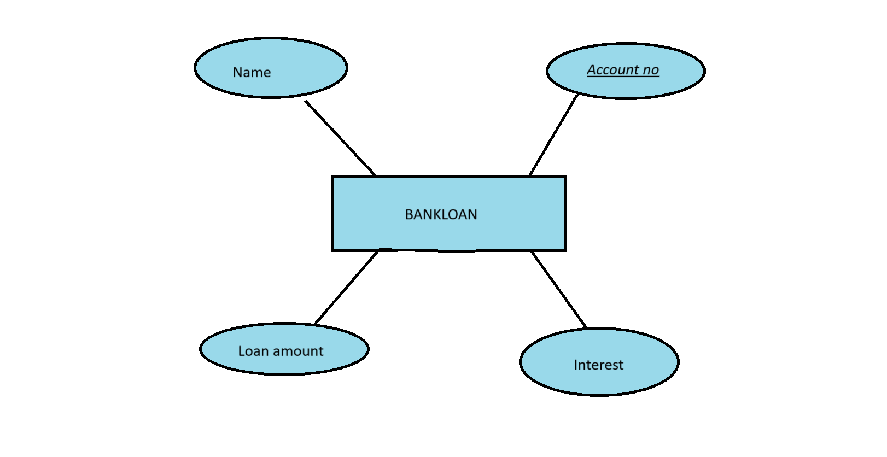

# Ex02 Django ORM Web Application
## Date: 26.10.2024

## AIM
To develop a Django application to store and retrieve data from a bank loan database using Object Relational Mapping(ORM).

## Entity Relationship Diagram



## DESIGN STEPS

### STEP 1:
Clone the problem from GitHub

### STEP 2:
Create a new app in Django project

### STEP 3:
Enter the code for admin.py and models.py

### STEP 4:
Execute Django admin and create details for 10 books

## PROGRAM
```
admin.py

from django.contrib import admin
from .models import bankloan,bankloanAdmin
admin.site.register(bankloan,bankloanAdmin

models.py

from django.db import models
from django.contrib import admin
class bankloan(models.Model):
      Name=models.CharField(max_length=15)
      accountno=models.IntegerField(primary_key="accountno")
      loan_amount=models.IntegerField()
      Interest=models.FloatField()
      
class bankloanAdmin(admin.ModelAdmin):
 
     list_display=('Name','accountno','loan_amount','Interest')
```


## OUTPUT


## RESULT
Thus the program for creating a database using ORM hass been executed successfully
